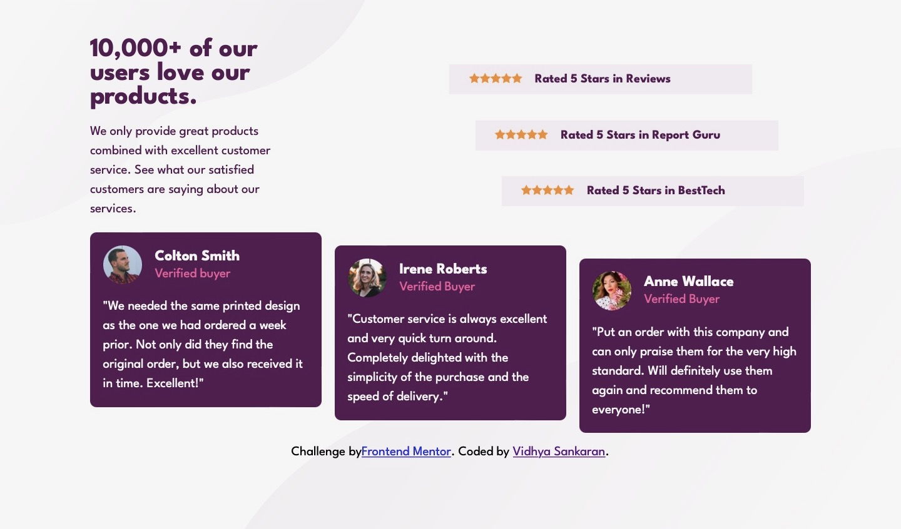

# Frontend Mentor - Social proof section solution

This is a solution to the [Social proof section challenge on Frontend Mentor](https://www.frontendmentor.io/challenges/social-proof-section-6e0qTv_bA). Frontend Mentor challenges help you improve your coding skills by building realistic projects. 

## Table of contents

- [Overview](#overview)
  - [The challenge](#the-challenge)
  - [Screenshot](#screenshot)
  - [Links](#links)
- [My process](#my-process)
  - [Built with](#built-with)
  - [What I learned](#what-i-learned)
  - [Continued development](#continued-development)
  - [Useful resources](#useful-resources)
- [Author](#author)

## Overview

### The challenge

Users should be able to:

- View the optimal layout for the section depending on their device's screen size

### Screenshot




### Links

- Solution URL: [Add solution URL here](https://your-solution-url.com)
- Live Site URL: [Add live site URL here](https://your-live-site-url.com)

## My process

### Built with

- Semantic HTML5 markup
- CSS custom properties
- Flexbox
- CSS Grid
- Mobile-first workflow


### What I learned

I learnt how to approach a mobile first workflow and then adapt to bigger screens with media queries. 
I have also tried to get a better grasp of grid and flexbox, and used it for responsive design. I took the time to understand grid-template-areas which helped me design a more intuitive solution, as the resulting css is easier to read and maintain. 
The third thing that I tried to understand was responsive typography with the use of em and rem units.
The code below adapts the grid column width with em units (that changes in code with screen size) and helps adapt the image size and column size with media queries.

```css
.comment {
  grid-template-columns: 4em 1fr;
  grid-template-areas: "image buyer"
                        "comment comment";
}
```

### Continued development

I want to continue developing more solutions to reinforce the things I am learning from various sources like online courses and youtube videos.


### Useful resources

- [Kevin Powell Learn CSS Grid the easy way](https://www.youtube.com/watch?v=rg7Fvvl3taU) - A tremendous resource to understand css grid.


## Author

- Website - [Vidhya Sankaran](https://www.your-site.com)
- Frontend Mentor - [@Vidshub](https://www.frontendmentor.io/profile/Vidshub)


